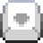
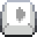
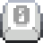
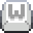
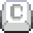
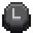
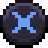

# Controls

## Keyboard Right

|  Key   |                                    |      Action       |
| :----: | :--------------------------------: | :---------------: |
| Up |  | Jump |
| Down |  | Crouch |
| Left |  | Move left |
| Right |  | Move right |
| K |  | Pickup/Drop |
| L |  | Attack |
| 0 |  | Toggle AI |

## Keyboard Left

|  Key   |                                    |      Action       |
| :----: | :--------------------------------: | :---------------: |
| W |  | Jump |
| S |  | Crouch |
| A |  | Move left |
| D |  | Move right |
| C |  | Pickup/Drop |
| V |  | Attack |
| 1 |  | Toggle AI |

## Gamepad

|  Input   |                                    |      Action       |
| :----: | :--------------------------------: | :---------------: |
| A Button |  | Jump |
| Y Button |  | Crouch |
| Left Thumbstick |  | Move left |
| Right Thumbstick |  | Move right |
| X Button |  | Pickup/Drop |
| B Button |  | Attack |
