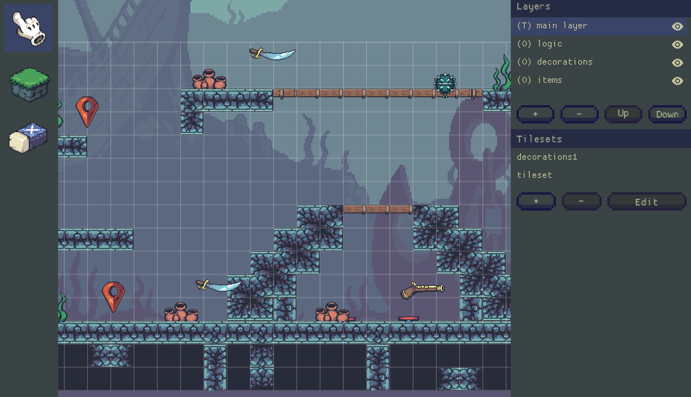
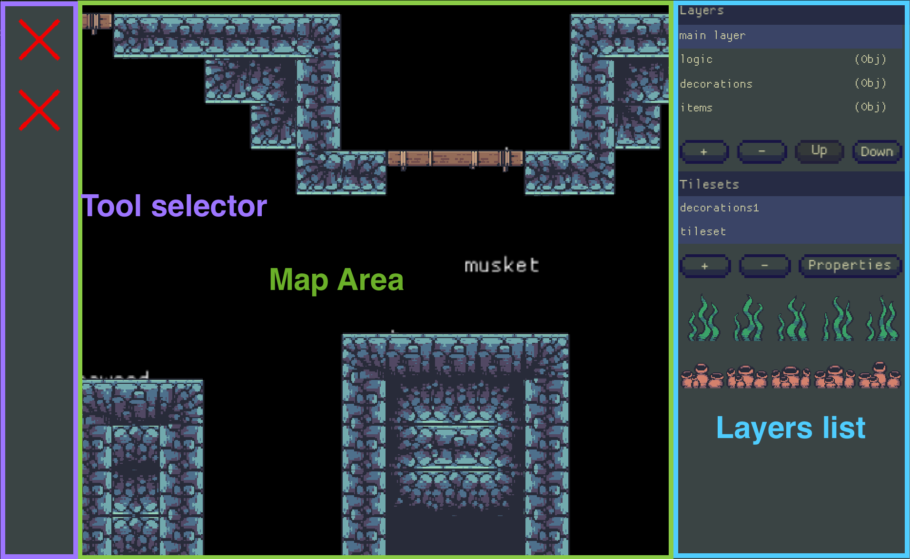

# Editor

The editor is a tool for designing custom levels in Fish Fight. You can use it to examine and edit
existing levels, and also create your own.
This chapter will contain guides on how to use all of the features the editor has to offer and even a
high-level overview of its API for those who are interested in contributing to its development.

## Accessing the editor

The editor can be accessed from the "Editor" tab on the main menu. Selecting this item by clicking on it, or using the right arrow key on your keyboard (or if you're using a gamepad: the "right button"), will present two options: "Create Map" and "Load Map".

## User-interface overview

There are 3 main areas of the UI for designing your level: the **tool selector**, **map**, and **layers list**. Perhaps the most important area is the map as it acts as a preview of your level. The tool selector and layers list are available as toolbars that provide a set of tools for you to edit and examine your level as needed.

**Note: Icons are not yet available for the tool selector. The first one is the tile placement tool and the second is the eraser tool.**

### Toolbars

There are currently 2 primary toolbars available for the editor: the layers list and tool selector.

#### Layers list

Create or edit layers of your Fish Fight level. This toolbar provides a list of selectable layers. Selecting a layer will display another view containing a list of the components grouped under that layer. There are currently 2 types of layers: tiles and objects:

**Tile layers** contain textures that can be placed in the map area. They can be created to be collision layers as well, allowing them to behave like collidable objects.

**Object layers** are composed of game objects categorized by a `MapObjectKind`. The current types of objects available are: `Item`, `SpawnPoint`, `Environment,` and `Decoration`.

#### Tool selector

As the name describes: provides a set of tools for editing layers in the map area of the editor. Currently, the following tools are available:

- Tile placement
- Eraser
