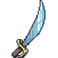
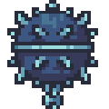
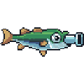
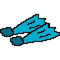
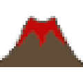
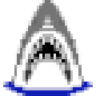
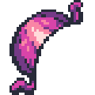

# Items

Items are placed in levels and can be interacted with by players.

| Name | | Description |
| :-: | :-: | :-: |
| Sword |  | Standard melee weapon. |
| Musket |  | Fires up to three bullets, normal recoil, normal bullet speed. |
| Sniper Rifle |  | Fires up to two bullets, high recoil, high bullet speed. |
| Machine Gun |  | Fires many bullets, low recoil, normal bullet speed. |
| Cannon |  | Fires up to three bombs, normal recoil. |
| Turtle Shell |  | Blocks two attacks from behind, then breaks. |
| Grenades |  | Throws up to three bombs that explode after short duration or on impact. |
| Mines |  | Place up to three mines that explode on contact. |
| Kick-Bomb |  | Explodes a set period of time after being thrown. Can be kicked by players. |
| Blunderbuss |  | Fires up to two spread shots, each containing five bullets. |
| Blunderbass |  | A blunderbuss that ate the Fish-Fish fruit. |
<!--| Life Ring |  | Inverts gravity for the user. |-->
<!--| Shoes |  | Allows user to attack players by jumping on their heads. |-->
<!--| Flippers |  | Allows user to attack players by jumping on their heads and allows player to jump multiple times. |-->
<!--| Galleon |  | Summons a galleon that travels across the arena. Kills anything in its path. |-->
<!--| Volcano |  | Summons a volcano that randomly shoots bombs into the arena. |-->
<!--| Shark Rain |  | Summons sharks that rain down from above. Kills anything in their path. |-->
<!--| Jellyfish |  | Fires a jellyfish that is controlled by the player and explodes impact. |-->
<!--| Sproinger |  | Bounces player when jumped on. |-->
