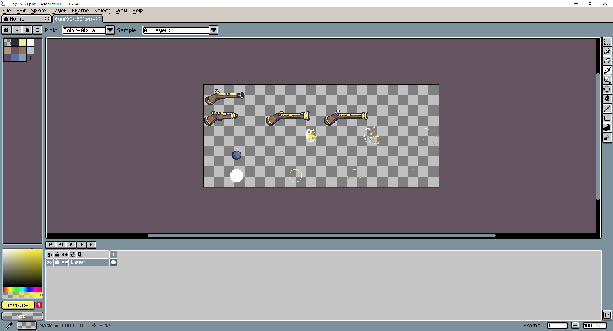
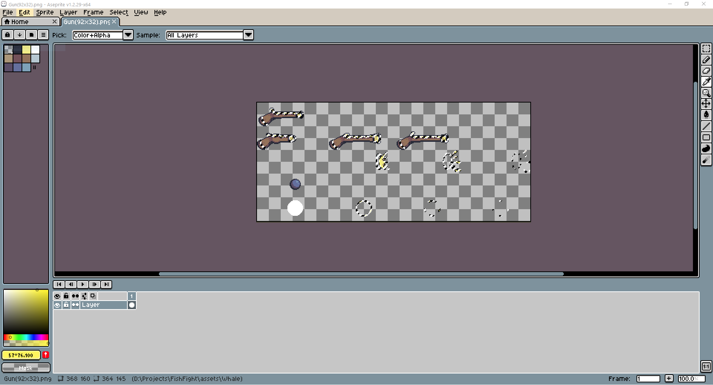

# Simple Gun Weapon

In this section we will walk through the process of adding a new gun weapon to Fish Fight. The instructions here will outline how we added the sniper rifle to the game, but our intent is for readers to follow along and be able to add their own gun weapons to the game.

## Planning

Before jumping into the games code, it is a good idea to do some planning about what you want your new weapon to do. I determined that my sniper weapon should have the following properties:

- High bullet speed
- High recoil
- High range
- 2 bullets

## Implementation

If you haven't already, fork FishFight and create branch with the name of the weapon you intend on adding. Then clone your forked repository, open the directory in your editor of choice, and checkout your new branch.

### Defining the Item

To add any item to the game (including weapons), you will first have to define the item in a data file. These files are located in
`assets/items` and will typically have the same name as the item's id. Since we are creating a sniper rifle, we can give this file the
name `sniper_rifle.json`. This path to the file must also be added to `assets/items.json`, so that the game will know where to look
for it. This is done by simply adding the path (relative to `items.json`) to the array within the file. In this case, the path
that we add will be `items/sniper_rifle.json`.

```json
[
  ...
  "items/sniper_rifle.json",
]
```

Now, it is time to define the weapons parameters inside the `sniper_rifle.json` file. Begin by creating a new object using curly braces and adding the item's id (`sniper_rifle`), it's display name (`Sniper Rifle`) and the item's type (`weapon`):

```json
...
{
  "id": "sniper_rifle",
  "name": "Sniper Rifle",
  "type": "weapon",
}
...
```

The item will need a collider defined for it. A collider is a rectangular boundary around the position of the item that is used for checking whether a player is close enough to pick it up. We'll set the collider for the sniper rifle to be a 16 by 16 box.

```json
{
  "id": "sniper_rifle",
  "name": "Sniper Rifle",
  "type": "weapon",
  "collider_size": {
    "x": 16,
    "y": 16
  },
}
```

This is all the required data for the item part (`ItemParams`) of our definition. Next, we need to add the parameters required for weapon items.

### Adding Weapon Parameters

We have quite a few options for customization that can be explored by looking at the `WeaponParams` struct in the source code.

First we'll add any attributes for the weapon that describe it's behavior. As we said at the beginning of the section, we wanted the sniper rifle to have high recoil, and 2 uses. We can add these to `sniper_rifle.json`. We'll set `uses` to 2 so that the sniper rifle can be shot twice and we'll set `recoil` to 1400 so that the player will be knocked back significantly when the gun is fired.

```json
{
  "id": "sniper_rifle",
  "name": "Sniper Rifle",
  "type": "weapon",
  "collider_size": {
    "x": 16,
    "y": 16
  },
  "uses": 2,
  "recoil": 14.0,
}
```

Next we'll need to define more subtle values that also will effect the behavior of the sniper rifle weapon: `cooldown` and `attack_duration`. `cooldown` is a period of time that governs how frequently the weapon can be used and `attack_duration` is the amount of time the player is locked in the attack state (input blocked) when the weapon is used. For the sniper rifle we'll set `cooldown` to 1.5 and `attack_duration` to 1.0.

```json
{
  "id": "sniper_rifle",
  "name": "Sniper Rifle",
  "type": "weapon",
  "sprite": {
    "texture": "musket"
  },
  "collider_size": {
    "x": 16,
    "y": 16
  },
  "uses": 2,
  "recoil": 14.0,
  "cooldown": 1.5,
  "attack_duration": 1.0,
}
```

Next, we can add a `sound_effect` that will played when the weapon is used. You add a new sound by putting a sound file in `assets/sounds` and registering it with id in `assets/sounds.json`, but for the sniper rifle weapon, we can use the same sound effect for the musket called "shoot".

```json
{
  "id": "sniper_rifle",
  "name": "Sniper Rifle",
  "type": "weapon",
  "collider_size": {
    "x": 16,
    "y": 16
  },
  "uses": 2,
  "recoil": 14.0,
  "cooldown": 1.5,
  "attack_duration": 1.0,
  "sound_effect": "shoot",
}
```

Next we'll define the active effects (`ActiveEffectParams`) of the weapon, or in other words, what happens when the weapon is used. In this case, we want the sniper rifle to shoot a projectile, so we will put `projectile` in the `type` field under `effects`. Then, also under `effects` we need to define the `projectile` effect. First we'll set the projectile's type to `sprite` and define the `sprite`  with a `texture` of the already existing `small_projectile` with a size of 8 by 4. Here, we can also give the projectile a `tint`.

```json
{
  "id": "sniper_rifle",
  "name": "Sniper Rifle",
  "type": "weapon",
  "collider_size": {
    "x": 16,
    "y": 16
  },
  "uses": 2,
  "recoil": 14.0,
  "cooldown": 1.5,
  "attack_duration": 1.0,
  "sound_effect": "shoot",
  "effects": {
    "type": "projectile",
    "projectile": {
      "type": "sprite",
      "sprite": {
        "texture": "small_projectile",
        "size": {
          "x": 8,
          "y": 4
        },
        "tint": {
          "r": 0.9,
          "g": 0.75,
          "b": 0.12,
          "a": 1.0
        }
      }
    },
  },
}
```

This is the place where we can implement the remaining attributes that we outlined at the top of the file: high bullet speed, and high range. We'll give the `projectile` a range of 600 and a speed of 25.

```json
{
  "id": "sniper_rifle",
  "name": "Sniper Rifle",
  "type": "weapon",
  "collider_size": {
    "x": 16,
    "y": 16
  },
  "uses": 2,
  "recoil": 14.0,
  "cooldown": 1.5,
  "attack_duration": 1.0,
  "sound_effect": "shoot",
  "effects": {
    "type": "projectile",
    "projectile": {
      "type": "sprite",
      "sprite": {
        "texture": "small_projectile",
        "size": {
          "x": 8,
          "y": 4
        },
        "tint": {
          "r": 0.9,
          "g": 0.75,
          "b": 0.12,
          "a": 1.0
        }
      }
    },
    "range": 600.0,
    "speed": 25.0
  },
}
```

The next step is to add the `animation` for the sniper rifle weapon to the json object. For now, we will give the sniper the same animation as the musket. We can set the `texture` of the animation to musket and define the `idle` and `attack` animation sequences by providing a `row` in the spritesheet, the amount of `frames` in the animation, and the speed (`fps`: frames per second) of the animation.

By default, the animation with an id of `idle` will be used when an item is on the ground, unless overridden by adding an animation with the id `ground`.

```json
{
  "id": "sniper_rifle",
  "name": "Sniper Rifle",
  "type": "weapon",
  "collider_size": {
    "x": 64,
    "y": 24
  },
  "uses": 2,
  "cooldown": 1.5,
  "attack_duration": 1.0,
  "recoil": 14.0,
  "sound_effect": "shoot",
  "effect_offset": {
    "x": 64,
    "y": 16
  },
  "effects": {
    "type": "projectile",
    "projectile": {
      "type": "sprite",
      "sprite": {
        "texture": "small_projectile",
        "size": {
          "x": 8,
          "y": 4
        },
        "tint": {
          "r": 0.9,
          "g": 0.75,
          "b": 0.12,
          "a": 1.0
        }
      }
    },
    "range": 600.0,
    "speed": 25.0
  },
  "animation": {
    "texture": "musket",
    "autoplay_id": "idle",
    "animations": [
      {
        "id": "idle",
        "row": 0,
        "frames": 1,
        "fps": 1
      },
      {
        "id": "attack",
        "row": 1,
        "frames": 3,
        "fps": 15
      }
    ]
  }
}
```

The last thing that we need to add to the json object definition of the sniper rifle weapon is an `effect_animation`. This is a visual effect that is shown. For the sniper rifle, we want to see a "blast" effect from the end of the barrel of the sniper when the weapon is used (just like for the musket). To implement this we can add `effect_animation` to the json object. First, we can set the `texture` to `musket` and provide an animation called `attack` with the correct `row`, `frames`, and `fps`.

```json
{
  "id": "sniper_rifle",
  "name": "Sniper Rifle",
  "type": "weapon",
  "collider_size": {
    "x": 64,
    "y": 24
  },
  "uses": 2,
  "cooldown": 1.5,
  "attack_duration": 1.0,
  "recoil": 14.0,
  "sound_effect": "shoot",
  "effect_offset": {
    "x": 64,
    "y": 16
  },
  "effects": {
    "type": "projectile",
    "projectile": {
      "type": "sprite",
      "sprite": {
        "texture": "small_projectile",
        "size": {
          "x": 8,
          "y": 4
        },
        "tint": {
          "r": 0.9,
          "g": 0.75,
          "b": 0.12,
          "a": 1.0
        }
      }
    },
    "range": 600.0,
    "speed": 25.0
  },
  "animation": {
    "texture": "musket",
    "autoplay_id": "idle",
    "animations": [
      {
        "id": "idle",
        "row": 0,
        "frames": 1,
        "fps": 1
      },
      {
        "id": "attack",
        "row": 1,
        "frames": 3,
        "fps": 15
      }
    ]
  },
  "effect_animation": {
    "texture": "musket",
    "animations": [
      {
        "id": "attack",
        "row": 2,
        "frames": 4,
        "fps": 12
      }
    ]
  }
}
```

If you like, you can skip to the testing section to test your new weapon, but if you haven't added a new texture or modified an existing texture, you will not be able to visually recognize your item before picking it up. For this reason, I recommend you continue to the [Texture](#texture) section next.

## Texture (Optional)

It is important to make sure that your weapon is able to be visually distinguished between the other weapons in the game. When we created the sniper rifle object, we used the musket texture for the `sprite`, `animation`, and `effect_animation`. In this section we will create a new custom texture for the sniper rifle and register it in `assets/textures.json`, then we will change `assets/items/sniper_rifle.json` to use this new texture.

To start off I'll copy the musket spritesheet image, `assets/textures/items/Musket(92x32)`, the "92x32" in the file name indicates that the size of each frame on the sprite sheet. I'll open this file with my pixel editor of choice, [Aseprite](https://www.aseprite.org/) ([GIMP](https://www.gimp.org/) would also work fine).



I don't consider myself an artist so I'm just going to modify the hue of the golden part of the gun texture to a reddish color. First I'll select a color range and adjust the threshold to select only the golden part of the gun texture.



Then I'll adjust the hue of the selected colors to turn all of the gold color red.


This texture is now distinguishable from the other gun textures in the game.

This, of course, is just one way of distinguishing the texture from the other textures in the game. Feel free to copy and modify textures using your own methods, or if you feel inclined, make your own unique texture for your weapon!

Now, all that remains is to add the new texture to the game. This is done by copying the texture file to the `assets/textures/items` directory and adding an entry to the file `assets/textures.json`.

Assuming a texture file name of `SniperRifle(92x32).png`, the following entry should be added to `assets/textures.json`:

```json
...
{
  "id": "sniper_rifle",
  "path": "textures/items/SniperRifle(92x32).png",
  "type": "spritesheet",
  "sprite_size": {
    "x": 92,
    "y": 32
  }
}
...
```

You will also have to change your weapons data file, so that it references this new texture, `"sniper_rifle"`, instead of `"musket"`. This is done by changing the `"texture"` fields of your weapon's `"sprite"`, `"animation"`, and `"effect_animation"` members to `"sniper_rifle"`.

## Size (Optional)

### Sprite

This section will go over how to go beyond changing the hue of an existing sprite to also changing the size of your new item's sprite. For my sniper, I want to change the length of the sprite in the x direction so the sniper will look significantly longer than the musket.

To start off, I'll open my existing sniper rifle texture (`assets/textures/items/SniperRifle(92x32).png`) in Aseprite. Then, to visualize the tiled sprites, I use Aseprite's grid feature (View > Grid Settings) to draw boxes around them. The size of the sprite sheet's tiles are the x and y values defined in `assets/textures.json` or included in the name of the texture file name. The size of the sprites in the sniper rifle texture is currently 92 (x) by 32 (y). In Aseprite I can enter these dimensions for width and height in the Grid Settings dialogue box. After entering these values, a grid will appear around the sprites as shown below.


Next, I need to determine by how much I want to change the sprite dimensions. For my sniper rifle, I only want to change the width of the sprite so that it has a longer barrel than the musket. Arbitrarily, I chose to extend the width of the spite by 20 pixels. This will make my new sprites' tiles dimensions 112 wide by 32 tall.

Now I need to do a little math to determine the size of the new spritesheet. Since the old spritesheet had 4 sprites across and 5 sprites up, the new spritesheet size will be (112 X 4) wide by (32 x 5) tall. This comes out to 448 wide by 160 tall. I'll create a new sprite sheet in Aseprite with these dimensions. With the new sprite sheet open in Aseprite, I'll again show the grid (View > Grid Settings), but this time with my new frame dimensions, 112 wide by 32 tall.


Next, one at a time, we can copy sprite frames from the old sprite sheet into the new one and modify them to fit the new weapon. I tried my best to match the art style of the musket and just add a 20 pixel long section of barrel to make the sniper rifle appear longer. Below is my new completed sprite sheet.


After you are done modifying the sprite sheet save the new sprite sheet as the name of your item followed by the dimensions of the each frame in the spritesheet surrounded by parentheses. I named my new sniper rifle sprite sheet `SniperRifle(112x32).png` and saved it into the the `assets/items/textures` directory.

The final step is to now change `assets/textures.json` to use the new sniper rifle spritesheet. I changed the `"path"` field use the name of the new file, and I changed the `"x"` and `"y"` dimensions in the `"sprite_size"` field to the new dimensions of the sniper rifle's frames:

```json
  ...
  {
    "id": "sniper_rifle",
    "path": "textures/items/SniperRifle(112x32).png",
    "type": "spritesheet",
    "sprite_size": {
      "x": 112,
      "y": 32
    }
  },
  ...
```

## Testing

The last thing we need to do is put our new weapon in the game and test it! This can be achieved by opening the game and selecting `Editor` from the main menu (see editor documentation for more information)

If you followed all of these steps correctly, your new weapon should be in the game. Run the game using `cargo run`, then select the test level. You should see your gun in the level and be able to try it out.


Now all you need to do is modify the values in `src/items/your_weapon.rs` until the weapon feels right to you! Then you are ready to make a pull request.
